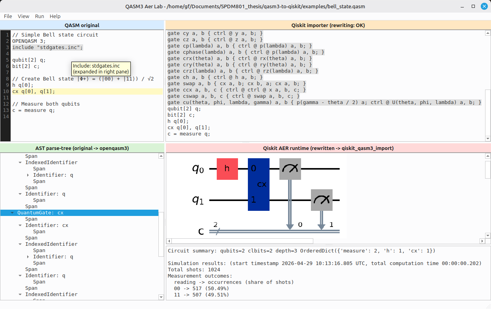

# QASM3 Aer Lab

Desktop tools for testing OpenQASM 3 rewrite compatibility with `qiskit-qasm3-import`, visualizing circuits, and running Aer simulations.

Official repository: https://github.com/GFcyborg/qasm3-to-qiskit

## Applications

### run.py - Circuit Analyzer and Simulator

Visualize and test OpenQASM 3 programs end-to-end.

- Left pane (`QASM original`): editable source text
- Top-right (`Qiskit importer`): rewritten importer-compatible QASM and rewrite diagnostics
- Bottom-left (`AST parse-tree`): parsed OpenQASM tree synchronized with editor cursor
- Bottom-right (`Qiskit AER runtime`): rendered circuit and runtime/status output

Runtime semantics:
- On edit, the app reparses and rewrites automatically.
- If the resulting circuit has no free parameters, simulation is started automatically.
- If the circuit has free parameters, use `Run -> Run manually (w/ params)` (or `Ctrl+R`) to enter parameter values and run.

### split.py - QASM Program Splitter

Split large OpenQASM 3 files into smaller chunks at statement boundaries, rewrite each independently, and launch isolated simulation windows.

- Left pane: original code with split-point markers (right-click to mark/unmark splits)
- Right pane: tabbed preview of each chunk after rewriting
- Save & Create Chunks: writes rewritten chunks to a directory named after the original file
- Run Chunks: launches independent `run.py` windows for each chunk

Workflow:
1. Load a QASM file
2. Right-click on lines where you want to split (lines turn red)
3. Preview chunks in the right tabs
4. Click "Save & Create Chunks" to write to disk (creates `<filename>/` directory)
5. Click "Run Chunks" to launch independent windows for each chunk

## Screenshot



## Requirements

- Python 3.9+
- Git

Usually enough on Linux:

```bash
sudo apt-get install -y git python3 python3-venv
```

If your platform cannot use prebuilt wheels for scientific dependencies, install build tools as needed (`build-essential`, `cmake`, compiler toolchain).

## Setup (fresh clone)

```bash
git clone https://github.com/GFcyborg/qasm3-to-qiskit.git
cd qasm3-to-qiskit
bash setup.sh
source .venv/bin/activate
python run.py      # Circuit analyzer
# or
python split.py    # Program splitter
```

What `setup.sh` does:

- Creates `.venv` if missing
- Activates it
- Upgrades `pip`
- Installs `requirements.txt`
- Verifies key imports (`PySide6`, `qiskit`, `qiskit_aer`, `qiskit_qasm3_import`, `openqasm3`)

Manual setup equivalent:

```bash
python3 -m venv .venv
source .venv/bin/activate
python -m pip install --upgrade pip
python -m pip install -r requirements.txt
```

## Common actions

### run.py
- Open examples: `File -> Examples`
- Manual run with parameter prompt: `Run -> Run manually (w/ params)`
- Apply rewrite to editor text: `Run -> Apply rewrite to source`
- Runtime/environment diagnostics: `Run -> Diagnostics`
- Show rewrite rules: `Help -> Rewrite rules`

### split.py
- Open examples: `File -> Examples`
- Mark split point: Right-click on a line, select "Add split after line N"
- Unmark split point: Right-click on a marked line, select "Remove split"
- Save chunks to disk: `Save & Create Chunks` button
- Launch chunk windows: `Run Chunks` button

## Implementation

Both `run.py` and `split.py` share a common rewriting engine (`qasm_rewriter.py`) to avoid code duplication. The rewriting logic (transpilation rules, AST walking, etc.) is defined once and used by both applications.

- `run.py`: Full circuit analysis and simulation
- `split.py`: Program splitting and bulk launching
- `qasm_rewriter.py`: Shared OpenQASM → Qiskit rewriting pipeline

## Pre-publish checks

Before pushing to GitHub:

```bash
source .venv/bin/activate
python run.py
python split.py
bash check_portability_paths.sh
```

## Clean-up

```bash
deactivate
rm -rf .venv
git restore .
git clean -fdX
```

Use `git clean -fd` only if you intentionally want to remove non-ignored untracked files too.

## Troubleshooting

- If the project folder is renamed, recreate or reactivate `.venv` from the new path to avoid stale absolute environment paths.
- If parser errors mention ANTLR runtime/type issues, confirm compatible `antlr4-python3-runtime` and generated grammar/runtime versions.
- Split chunks should preserve all qubit declarations and gate definitions; the rewriter handles this automatically.

## License

- Main application: GPL-3.0 (see `LICENSE`)
